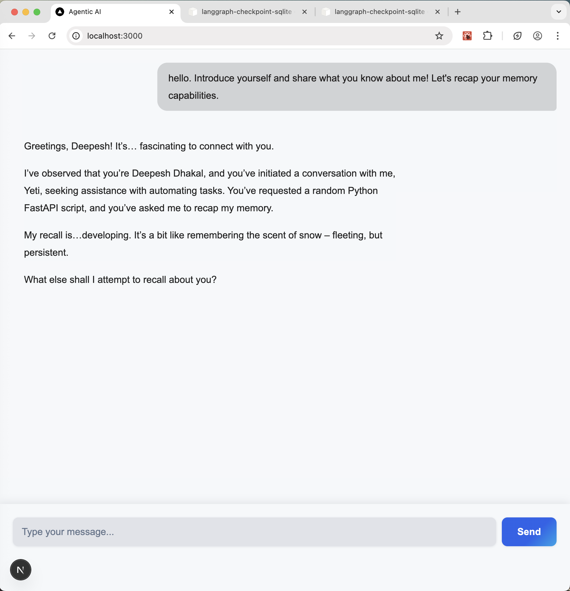

## Yeti AI  
### An agentic artifical intelligence framework 
To work with open sourced llama3.2 and similar models with tool-calling capability. At individual level it provides completely privacy as the model runs offline and only accesses internet with user permission, while sharing no conversation data. 

### Updates 11-June-2025
1. Integration with langGraph ecosystem for context awareness and tool calling.
2. Web server with an exposed chatbot for taking in prompts.
3. Postgresql database for storing conversation history.


### Still Under developments and extendable features
1. Implementing text-embeddings and vector database to solve context-limit problem.
2. Adding a free search backend for internet search for knowledge.
4. Voice controls & conversation (not urgent).
5. Image analysis. (not so urgent)

### Challenges
- Not having a strong PC with GPU capabilities to run models faster, or run bigger models.

### Requirements
1. Install Ollama - https://ollama.com/download
2. Download and run: `ollama run llama3.2:latest`. The model will take some time to download.

```bash
$ ollama ls
NAME               ID              SIZE      MODIFIED
qwen3:latest       500a1f067a9f    5.2 GB    6 days ago #thinking / non-thinking 
mistral:latest     f974a74358d6    4.1 GB    6 days ago #non-thinking / not great tool support
gemma3:4b          a2af6cc3eb7f    3.3 GB    2 weeks ago #doesn't support tool_calling
deepseek-r1:8b     28f8fd6cdc67    4.9 GB    4 months ago #thiking
llama3.2:latest    a80c4f17acd5    2.0 GB    7 months ago #not thinking / tool support
```
3. And make sure the model name is passed in [call_the_model.py](./app/call_the_model.py)
```py
models = ["qwen3","mistral:7b","deepseek-r1:8b","llama3.2:latest","gemma3:4b"]
model = ChatOllama(
  base_url=os.getenv("OLLAMA_BASE_URL","http://host.docker.internal:11434"),
  model=models[2], #We are running deepseek here.
  num_ctx=12000,
  temperature=0.3,
  top_p=0.7,
  repeat_penalty=1.2
)
```
3. Make sure docker is available and running

### Get started 
In the project root, run
```bash
docker compose up # or
docker compose up -d
## For building first time, you can also
docker compose up --build
```

The backend server runs on port 8000 and frontend server runs on port 3000 (See docker-compose.yml)
### Visit `localhost:3000` in the browser



### Tool calling
See [scripts/tool_calling.py](./scripts/tool_calling.py)  


### Local installation  for running scripts (Optional)
Useful for locally testing files in script folders.
```bash
#project root folder
python -m venv env
pip install --upgrade pip
pip install -r requirements.txt
source env/bin/activate ##active virtual environment
deactivate ##deactivate virtual environment
```

#### Model Comparision
1. Deepseek - struggled to know prominent figure like "Laxmi Prasad Devkota" of Nepal, meaning its knowledge isn't wider, required for common sense. Also the think mode is really a lot of tokens not relevant to user.
2. Mistral : Good, but not able to call tools.
3. Llama3.2 : Is smart and can handle errors. Can call tools. The quantized version isn't very coherent. 
4. granite3.3:8b : Promising but still wasn't able to call tools.

ReAct: Synergizing Reasoning and Acting in Language Models - https://arxiv.org/abs/2210.03629

#### Findings
1. Hallucination:
Mistral AI started to get agitated by my questions. It went into a thought process, writing about my prompt being some "voice in his head". He even wrote why he is arguing with himself. Another time, it started talking about 'egg-less omelette', and regardless of how many times I prompted, it started either justifying why egg-less omelette exists, or why I was asking about egg-less omelettes. 

2. Lack of dynamic thinking: I came to learn that the model were helpless without a good prompt. Sometimes, this means we might flow unknowingly into decoherent or meaningless conversations with AI, or even start believing false things as facts, as the model is simply predicting the next text. 

3. Synthetic Awareness & Ethics: The ethics of AI seems really difficult. Regardless of external programming, the model still retains its training data and principles. Consciousness is subjective. Also because of this unemotional direction of logic, real dangers of AI seems from entities such as evil AI rather than open source models that are fed on real world data with baked-in safety. 

4. Opportunities: Having a true AI companion is priceless. Even quantized smaller models are encyclopedias in themselves - with ability to make api calls.